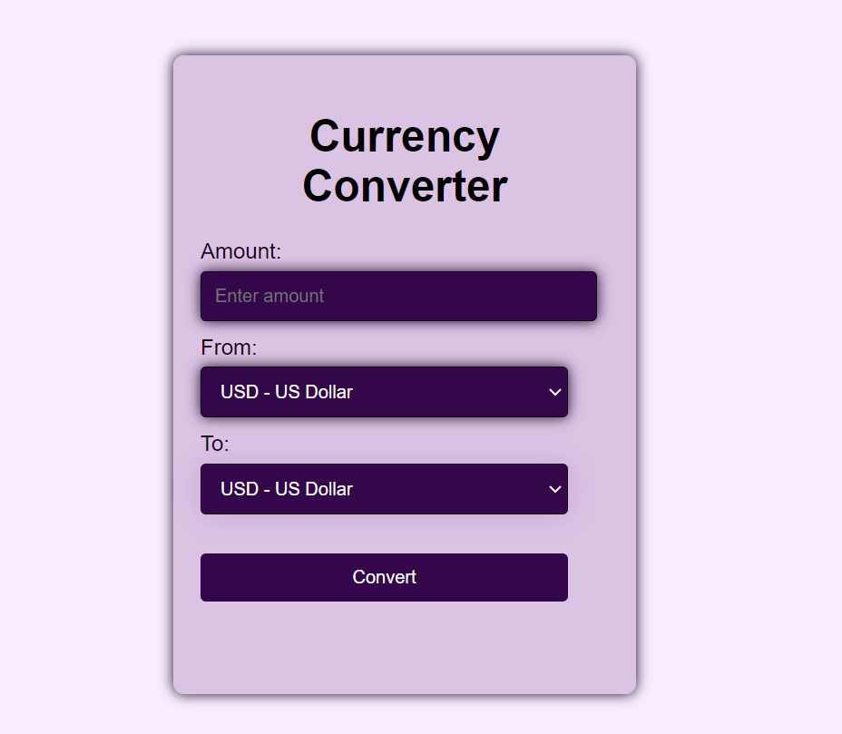

# Currency Converter 💱🌍
A Currency Converter application built with HTML, CSS, and JavaScript that allows users to easily convert between different currencies with real-time exchange rates.

## Key Features:
* Real-Time Conversion: Convert currencies in real-time with up-to-date exchange rates.
* Multi-Currency Support: Choose from a wide range of currencies across the globe.
* Interactive User Interface: Enter amounts and instantly see the converted values.
vResponsive Design: The app is fully responsive, ensuring usability on all devices.
* Error Handling: Provides alerts for invalid inputs and handles network issues gracefully.

## How to Use:
* Select the currency you want to convert from and the currency you want to convert to.
* Enter the amount in the input field.
* Click on the Convert button to get the result.

## Technologies Used:
* HTML5 for the page structure.
* CSS3 for styling and layout.
* JavaScript for fetching exchange rates and performing the conversion.
## Installation:
* Clone the repository:
git clone https://github.com/your-username/currency-converter.git
* Open the index.html file in your browser.
## Future Enhancements:
* Adding support for more languages.
* Implementing historical exchange rate data.
* Option to save favorite conversions.
